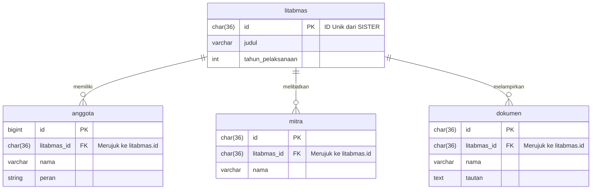

# 🔗 Relasi Database SISTER (Litabmas)

Dokumen ini menjelaskan bagaimana tabel-tabel dalam database `penelitian` saling berhubungan menggunakan **Foreign Keys (FK)**.

---

## 🏗️ Struktur Master-Detail

Sistem ini menggunakan pola **Master-Detail**. Artinya, ada satu tabel utama ("Master") dan beberapa tabel pendukung ("Detail/Child").

### 1. Tabel Utama: `litabmas` (Master)
Tabel ini menyimpan data inti penelitian (Judul, Tahun, Skim, dll).
*   **Kolom `id`**: Ini adalah **Primary Key (PK)**. Nilainya berupa UUID (misal: `d34ed020-8ddb...`) yang didapat langsung dari SISTER.
*   `id` ini bersifat unik; tidak boleh ada dua baris dengan `id` yang sama.

### 2. Tabel Pendukung (Detail)
Tabel `anggota`, `mitra`, dan `dokumen` adalah detail dari sebuah penelitian.
*   Setiap baris di tabel ini **harus** merujuk ke salah satu penelitian di tabel `litabmas`.
*   Penghubungnya adalah kolom bernama **`litabmas_id`**.

---

## 🗝️ Apa itu Foreign Key (litabmas_id)?

Kolom **`litabmas_id`** pada tabel anggota/mitra/dokumen disebut **Foreign Key (FK)**. Fungsinya adalah "KTP" yang menunjuk ke penelitian mana data tersebut berasal.

**Contoh Sederhana:**
1. Di tabel `litabmas`, ada penelitian dengan `id` = `ABC-123`.
2. Di tabel `anggota`, ada 3 orang. Ketiganya memiliki kolom `litabmas_id` = `ABC-123`.
3. Database jadi tahu: *"Oh, 3 orang ini adalah anggota dari penelitian ABC-123"*.

---

## 📊 Visualisasi Relasi



---

## 🔍 Cara Mengambil Data (SQL Join)

Jika Anda ingin melihat Judul Penelitian beserta Nama Anggotanya, Anda harus "menggabungkan" tabelnya:

```sql
SELECT 
    l.judul, 
    a.nama AS nama_anggota, 
    a.peran
FROM litabmas l
JOIN anggota a ON l.id = a.litabmas_id
WHERE l.id = 'ID_PENELITIAN_ANDA';
```

---

## 💡 Ringkasan
*   **`litabmas.id`** = ID Unik Penelitian (Pemilik data).
*   **`litabmas_id`** (di tabel lain) = Tanda pengenal penelitian yang diikuti (Gantungan data).
*   **Cascade**: Jika Anda menghapus satu baris di `litabmas`, maka secara otomatis semua `anggota`, `mitra`, dan `dokumen` yang berhubungan akan **ikut terhapus** (dijaga oleh database agar tidak ada data sampah).
